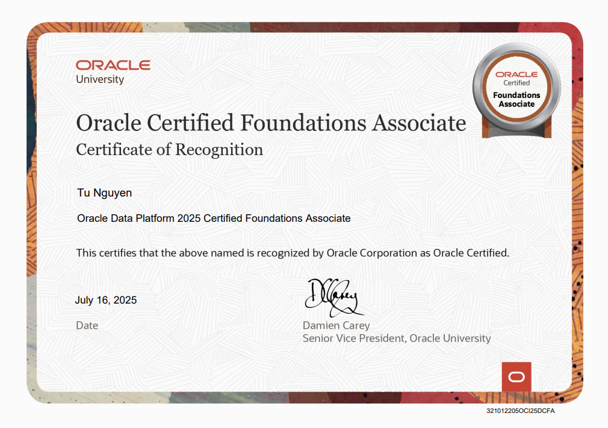
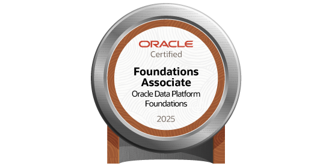

# Oracle Data Platform 2025 Foundations Associate – Exam Q&A Summary

This document summarizes selected questions from the 1Z0-1195-25 certification exam, including full question text, all answer options, correct answers, and explanations.

My Certificate:

Certify my badge with [this link](https://catalog-education.oracle.com/ords/certview/sharebadge?id=4E56A8F6F56FE5E0154FDEDEFC0B9D29E7122E9CEFDF0C44359497AF087EEAA0):

---

### **Q1. Which two are key characteristics of Oracle Autonomous Database?**

**Options:**
- Less automated  
- Lower cost  
- Higher cost  
- Customer manages everything  
- Oracle manages everything  

✅ **Correct Answers:**  
- Lower cost  
- Oracle manages everything  

💡 **Explanation:**  
Oracle Autonomous Database automates management tasks such as patching, tuning, and backups, reducing the need for manual intervention and overall cost. Oracle manages everything, freeing up users from administrative overhead.

---

### **Q2. Which two are objectives of Oracle’s Data Management strategy?**

**Options:**
- Provide for the fastest, most scalable converged SQL database  
- Provide the best platform for warehouse workloads only  
- Offer multiple integration points for 3rd party databases that work better for mixed and analytic workloads  
- Automate everything for developers, data analysts, DBAs and data scientists  

✅ **Correct Answers:**  
- Provide for the fastest, most scalable converged SQL database  
- Automate everything for developers, data analysts, DBAs and data scientists  

💡 **Explanation:**  
Oracle aims to deliver a converged platform that supports multiple workloads while automating tasks across the data lifecycle for all user roles.

---

### **Q3. Which two methods can you use to create or modify Oracle Cloud Infrastructure (OCI) resources?**

**Options:**
- Secure Shell (SSH)  
- OCI Command-line Interface (CLI)  
- Serial console connection (SCC)  
- Remote Desktop Protocol (RDP)  
- OCI REST APIs  

✅ **Correct Answers:**  
- OCI Command-line Interface (CLI)  
- OCI REST APIs  

💡 **Explanation:**  
Both CLI and REST APIs are official tools to interact with OCI for provisioning, modifying, and deleting resources programmatically.

---

### **Q4. Which feature allows you to logically group and isolate your Oracle Cloud Infrastructure resources?**

**Options:**
- Compartments  
- Tenancy  
- Identity and Access Management Groups  
- Availability Domain  

✅ **Correct Answer:**  
- Compartments  

💡 **Explanation:**  
Compartments are a core feature in OCI that enable logical grouping and isolation of cloud resources for governance and access control.

---

### **Q5. What information is required to connect to the NoSQL Database Cloud Service?**

**Options:**
- API signing key, admin ID, user ID  
- Tenancy ID, passphrase, handshake key  
- Signing key fingerprint, API signing key, tenancy OCID  
- User ID, tenancy ID, component ID  

✅ **Correct Answer:**  
- Signing key fingerprint, API signing key, tenancy OCID  

💡 **Explanation:**  
These identifiers are needed to authenticate and authorize secure connections to Oracle Cloud APIs, including NoSQL.

---

### **Q6. What is the primary goal of Oracle Maximum Availability Architecture for customer systems?**

**Options:**
- Data Protection, access and reporting  
- Continuous Availability, network security and failover  
- Scale out, application availability and protection  
- Active Replication, Data Protection and continuous availability  

✅ **Correct Answer:**  
- Active Replication, Data Protection and continuous availability  

💡 **Explanation:**  
Oracle MAA focuses on minimizing downtime and data loss through active replication and robust failover strategies.

---

### **Q7. Oracle AutoML has options for using in-database and open-source algorithms. Which is an example of an in-database option?**

**Options:**
- Tuning of hyperparameter  
- Cognitive text  
- REST Interface  
- Oracle Machine Learning for Python (OML4Py) APIs  

✅ **Correct Answer:**  
- Tuning of hyperparameter  

💡 **Explanation:**  
AutoML in Oracle Database runs natively using in-database features such as automated model selection and hyperparameter tuning.

---

### **Q8. Oracle Cloud and Microsoft Azure have an interconnect for workloads across cloud. Which two are also benefits this partnership and interconnect provide?**

**Options:**
- Upgrade compliance  
- Connection to other multicloud environments  
- Low Latency  
- Unified identity and access management  

✅ **Correct Answers:**  
- Low Latency  
- Unified identity and access management  

💡 **Explanation:**  
The interconnect provides high-throughput, low-latency connectivity and integrated IAM for a seamless multicloud experience.

---

### **Q9. What connections to multiple public clouds are provided through 3rd party connectivity?**

**Options:**
- FastConnect and Direct Connect  
- Virtual Cloud Networks (VCNs) and Amazon Virtual Private Cloud (VPC)  
- Layer 3 and FastConnect  
- Megaport Cloud Router (MCR) and Virtual Cross Connect (VXC)  

✅ **Correct Answer:**  
- Megaport Cloud Router (MCR) and Virtual Cross Connect (VXC)  

💡 **Explanation:**  
These third-party services facilitate private multi-cloud connectivity across cloud vendors like Oracle, AWS, and Azure.

---

### **Q10. Which security measure is implemented out-of-the-box, and is included if you are not using BYOL licensing with Exadata Cloud@Customer?**

**Options:**
- Oracle Key Vault  
- Database Vault and Data Masking Pack  
- Oracle Native Network Encryption and TDE (Transparent Data Encryption)  
- Audit Vault and Database Firewall  

✅ **Correct Answer:**  
- Oracle Native Network Encryption and TDE (Transparent Data Encryption)  

💡 **Explanation:**  
These are enabled by default and included in the Oracle license for Cloud@Customer deployments (non-BYOL).

---

### **Q11. Which two statements are true when deciding which Oracle Cloud Infrastructure (OCI) region to register an Exadata Cloud@Customer infrastructure in?**

**Options:**
- The Exadata Cloud@Customer region can be changed after the infrastructure is created.  
- Consider any business policies or regulations that preclude the use of a particular region.  
- Consider which availability domain (within the region) to create the Exadata Cloud@Customer infrastructure in.  
- Exadata Cloud@Customer is hosted in a customer data center so the Exadata infrastructure is not registered in an OCI region.  
- Consider the physical proximity of the region you register the infrastructure in to your data center.  

✅ **Correct Answers:**  
- Consider any business policies or regulations that preclude the use of a particular region.  
- Consider the physical proximity of the region you register the infrastructure in to your data center.  

💡 **Explanation:**  
OCI region selection must account for compliance and latency needs. Once chosen, it cannot be changed. Availability domains are irrelevant because the system runs on-premises.

---

### **Q12. Which service is used by default by the MySQL Database Service to store user data to make it more resistant to failures?**

**Options:**
- OCI File Storage  
- OCI Data Safe  
- OCI Block Volumes  
- OCI Object Storage  

✅ **Correct Answer:**  
- OCI Block Volumes

💡 **Explanation:**  
MySQL Database Service on OCI uses OCI Block Volumes by default for user data. This ensures high durability, availability, and resilience against failures.

---

### **Q13. What are two typical reasons why customers CANNOT move their database into the public cloud?**

**Options:**
- Regulations that prevent moving data into the public cloud  
- Putting data in the cloud would break data residency rules  
- Public cloud does not provide storage for more than 10TB  
- Total Cost of Ownership in public cloud is higher than on-premises  

✅ **Correct Answers:**  
- Regulations that prevent moving data into the public cloud  
- Putting data in the cloud would break data residency rules  

💡 **Explanation:**  
Regulatory and legal requirements, especially around data sovereignty and residency, often prevent organizations from storing sensitive data in the public cloud.

---

### **Q14. The DBA has determined that number of OCPU assigned to an Autonomous Database does not provide sufficient performance. Which option does the DBA have in this case?**

**Options:**
- No downtime is required as number of OCPU can be increased from OCI console, but users must not use any application for at least one hour.  
- Plan for a one-hour downtime and increase the number of OCPU, while database is offline.  
- Call Oracle Cloud Support and raise a request to increase number of OCPU. Expect a downtime of approximately one hour.  
- Open the database in OCI Console and increase the number of OCPU. No downtime required.  

✅ **Correct Answer:**  
- Open the database in OCI Console and increase the number of OCPU. No downtime required.

💡 **Explanation:**  
Autonomous Database supports online scaling of OCPUs via OCI Console with zero downtime, making it ideal for dynamic workloads.

---

### **Q15. Which deployment option provides the highest degree of security and governance while providing a completely self-service database experience?**

**Options:**
- Oracle MySQL Database Service  
- Oracle Database Cloud Service  
- Exadata Cloud Service  
- Oracle Autonomous Database  

✅ **Correct Answer:**  
- Oracle Autonomous Database

💡 **Explanation:**  
Oracle Autonomous Database is self-driving, self-securing, and self-repairing, with built-in governance and automated security features.

---

### **Q16. What are two characteristics of Oracle SQLcl (SQL Developer Command Line)?**

**Options:**
- Tracks database schema changes  
- Ability to execute SQL batch files  
- Creates isolated development environments  
- Available in the OCI Cloud Shell by default  

✅ **Correct Answers:**  
- Tracks database schema changes  
- Ability to execute SQL batch files  

💡 **Explanation:**  
SQLcl supports Liquibase for versioning schema changes and running SQL scripts/batch files. It’s a command-line utility for automation and DevOps workflows.

---

### **Q17. Which is NOT an option in Database Actions to load data into Autonomous Database?**

**Options:**
- Load data using Data Pump  
- Load data from a remote database  
- Load data from a local file such as text or Excel  
- Load data using FTP  
- Load data from cloud storage (Oracle, S3, Azure, Google)  

✅ **Correct Answer:**  
- Load data using FTP

💡 **Explanation:**  
FTP is not a supported method in Database Actions due to security concerns. Other methods like Data Pump, local files, and cloud storage are fully supported.

---

### **Q18. Which statement can be detected by monitoring of access to sensitive data?**

**Options:**
- SELECT * from EMPLOYEES  
- SELECT SYSDATE from DUAL  
- CREATE index emp_id_idx on EMPLOYEES(emp_id);  
- UPDATE quarter_reference set Q1='012022'  

✅ **Correct Answer:**  
- SELECT * from EMPLOYEES

💡 **Explanation:**  
Monitoring tools like Oracle Data Safe can flag access to sensitive data such as the EMPLOYEES table. SELECT operations are key targets for audit.

---

### **Q19. What security control area determines if there is sensitive data in a system?**

**Options:**
- Detect  
- Assess  
- Protect  
- Users  

✅ **Correct Answer:**  
- Assess

💡 **Explanation:**  
“Assess” is the security control area responsible for discovering and classifying sensitive data within your systems.

---

### **Q20. Which Oracle Cloud Infrastructure (OCI) service is NOT available for provisioning in your tenancy as an Always Free resource?**

**Options:**
- Block Volume (up to 100 GB total storage)  
- Fast Connect (1 Gbps public peering)  
- Load Balancing (one load balancer)  
- Autonomous Database (up to two database instances)  

✅ **Correct Answer:**  
- Fast Connect (1 Gbps public peering)

💡 **Explanation:**  
Fast Connect is a premium networking service and is not included in the Always Free tier of OCI services.

---

### **Q21. What are two main benefits of Oracle APEX?**

**Options:**
- Rapidly develop, customize, and deliver secure applications  
- Less productivity compared to hand coding  
- Develop responsive web apps  
- Faster development time using hand coding  
- Store data in PL/SQL objects  

✅ **Correct Answers:**  
- Rapidly develop, customize, and deliver secure applications  
- Develop responsive web apps

💡 **Explanation:**  
Oracle APEX is a low-code platform that enables rapid development of secure, responsive web apps without needing extensive hand coding.

---

### **Q22. Which Lakehouse service should you use for serverless Spark processing?**

**Options:**
- OCI Data Flow  
- OCI Object Storage  
- OCI Data Catalog  
- Oracle Analytics Cloud  

✅ **Correct Answer:**  
- OCI Data Flow

💡 **Explanation:**  
OCI Data Flow is a serverless Apache Spark service used for large-scale data processing on Oracle Cloud Infrastructure.

---

### **Q23. What resource does RDMA access in Exadata X8M?**

**Options:**
- Compute Instances  
- Database Servers  
- Storage Disks  
- Persistent Memory  

✅ **Correct Answer:**  
- Persistent Memory

💡 **Explanation:**  
Remote Direct Memory Access (RDMA) allows direct access to persistent memory between database and storage servers with minimal latency.

---

### **Q24. When customers are using the Exadata Cloud Service, what are they responsible for managing?**

**Options:**
- Host VM and Storage  
- Internal Fabric and Customer VMs  
- Hypervisor and Internal Fabric  
- Databases and Customer VM  

✅ **Correct Answer:**  
- Databases and Customer VM

💡 **Explanation:**  
In Exadata Cloud Service, Oracle manages the infrastructure. Customers are responsible for managing databases and their virtual machines (VMs).

---

### **Q25. Which OCI service is the most cost-effective for old database backups?**

**Options:**
- Block Volume  
- File Storage  
- Archive Storage  
- Object Storage (standard)  

✅ **Correct Answer:**  
- Archive Storage

💡 **Explanation:**  
OCI Archive Storage is designed for infrequent access and is the most cost-effective solution for long-term storage such as database backups.

---

### **Q26. Which OCI storage service allows storing backups for months but quick retrieval?**

**Options:**
- Block Volume  
- Archive Storage  
- File Storage  
- Object Storage (standard)  

✅ **Correct Answer:**  
- Object Storage (standard)

💡 **Explanation:**  
Standard tier Object Storage is ideal for storing data that may be needed immediately, making it suitable for backup retrieval scenarios.

---

### **Q27. Which OCI IAM capability helps organize multiple users into teams?**

**Options:**
- Users  
- Policies  
- Groups  
- Roles  

✅ **Correct Answer:**  
- Groups

💡 **Explanation:**  
In OCI Identity and Access Management (IAM), Groups are used to manage permissions for sets of users through policies.

---

### **Q28. How does Converged Database help to access data using an API?**

**Options:**
- The database provides only one universal REST interface  
- Developers point to the ADB Wallet to integrate REST  
- REST-enabled compute instance is provisioned by default  
- A REST API is automatically generated on top of SQL or stored procedures  

✅ **Correct Answer:**  
- A REST API is automatically generated on top of SQL or stored procedures

💡 **Explanation:**  
Oracle REST Data Services (ORDS) enables automatic RESTful APIs for SQL queries and stored procedures in Converged Database.

---

### **Q29. What three data types/models are covered by Oracle’s Converged Database?**

**Options:**
- Relational  
- Notifications  
- Graph  
- Images  
- Events  
- Terraform  
- Spatial  

✅ **Correct Answers:**  
- Relational  
- Graph  
- Spatial

💡 **Explanation:**  
Oracle Converged Database supports multiple data models including relational (SQL), graph (relationships), and spatial (geolocation).

---

### **Q30. Which tool supports CI/CD workflows?**

**Options:**
- SQLcl (including Liquibase)  
- Database Actions  
- SQL Developer (including ADB wallet)  
- ADB Console (including Performance Hub)  

✅ **Correct Answer:**  
- SQLcl (including Liquibase)

💡 **Explanation:**  
SQLcl is a command-line tool that integrates with Liquibase for schema version control in CI/CD pipelines.

---

### **Q31. What are two characteristics of SQLcl?**

**Options:**
- Tracks database schema changes  
- Ability to execute SQL batch files  
- Creates isolated development environments  
- Available in the OCI Cloud Shell by default  

✅ **Correct Answers:**  
- Tracks database schema changes  
- Ability to execute SQL batch files

💡 **Explanation:**  
SQLcl supports automation through scripting and integration with Liquibase for schema change management.

---

### **Q32. Which is NOT an option in Database Actions to load data into Autonomous Database?**

**Options:**
- Load data using Data Pump  
- Load data from a remote database  
- Load data from a local file such as text or Excel  
- Load data using FTP  
- Load data from cloud storage  

✅ **Correct Answer:**  
- Load data using FTP

💡 **Explanation:**  
FTP is not supported due to security concerns. Other options like Data Pump and cloud storage are preferred.

---

### **Q33. Which statement can be detected by monitoring of access to sensitive data?**

**Options:**
- SELECT * from EMPLOYEES  
- SELECT SYSDATE from DUAL  
- CREATE index on EMPLOYEES  
- UPDATE quarter_reference  

✅ **Correct Answer:**  
- SELECT * from EMPLOYEES

💡 **Explanation:**  
SELECT queries on sensitive tables (e.g., EMPLOYEES) can be flagged for security monitoring and auditing.

---

### **Q34. What security control area determines if there is sensitive data in a system?**

**Options:**
- Detect  
- Assess  
- Protect  
- Users  

✅ **Correct Answer:**  
- Assess

💡 **Explanation:**  
The "Assess" function in Oracle Data Safe scans and identifies sensitive data stored within your system.

---

### **Q35. Which OCI service is NOT part of Always Free tier?**

**Options:**
- Block Volume (100 GB)  
- Fast Connect (1 Gbps public peering)  
- Load Balancer  
- Autonomous Database (2 instances)  

✅ **Correct Answer:**  
- Fast Connect (1 Gbps public peering)

💡 **Explanation:**  
Fast Connect is a premium high-speed networking option and is not included in the Always Free resource tier.

---
### **Q36. Which two statements are true about Oracle SQLcl (SQL Developer Command Line)?**

**Options:**
- Tracks database schema changes  
- Ability to execute SQL batch files  
- Creates isolated development environments  
- Available in the OCI Cloud Shell by default  

✅ **Correct Answers:**  
- Tracks database schema changes  
- Ability to execute SQL batch files

💡 **Explanation:**  
SQLcl supports running scripts and integrates with Liquibase for schema version control, enabling DevOps and CI/CD workflows.

---

### **Q37. Which is NOT an option in Database Actions to load data into Autonomous Database?**

**Options:**
- Load data using Data Pump  
- Load data from a remote database  
- Load data from a local file such as text or Excel  
- Load data using FTP  
- Load data from cloud storage (Oracle, S3, Azure, Google)  

✅ **Correct Answer:**  
- Load data using FTP

💡 **Explanation:**  
FTP is not supported in Oracle Database Actions due to security limitations. All other options are valid data import methods.

---

### **Q38. Which statement can be detected by monitoring of access to sensitive data?**

**Options:**
- SELECT * from EMPLOYEES  
- SELECT SYSDATE from DUAL  
- CREATE index emp_id_idx on EMPLOYEES(emp_id);  
- UPDATE quarter_reference set Q1='012022'  

✅ **Correct Answer:**  
- SELECT * from EMPLOYEES

💡 **Explanation:**  
Access to sensitive data like the EMPLOYEES table using a SELECT statement is commonly monitored for audit and security.

---

### **Q39. What security control area determines if there is sensitive data in a system?**

**Options:**
- Detect  
- Assess  
- Protect  
- Users  

✅ **Correct Answer:**  
- Assess

💡 **Explanation:**  
The “Assess” control in Oracle Data Safe is used to discover and classify sensitive data, providing visibility and risk awareness.

---

### **Q40. Which Oracle Cloud Infrastructure (OCI) service is NOT available for provisioning in your tenancy as an Always Free resource?**

**Options:**
- Block Volume (up to 100 GB total storage)  
- Fast Connect (1 Gbps public peering)  
- Load Balancing (one load balancer)  
- Autonomous Database (up to two database instances)  

✅ **Correct Answer:**  
- Fast Connect (1 Gbps public peering)

💡 **Explanation:**  
Fast Connect is a premium networking solution and is not included as part of the Always Free tier.

---